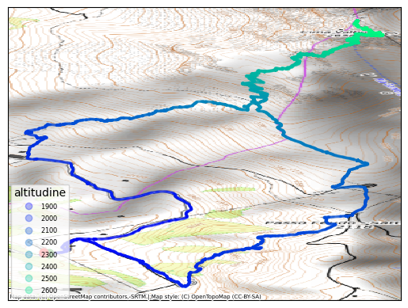
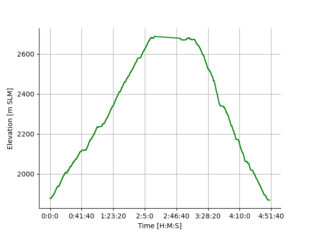
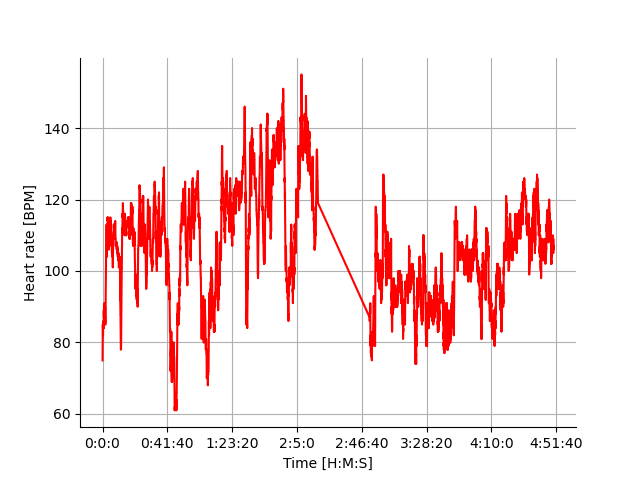
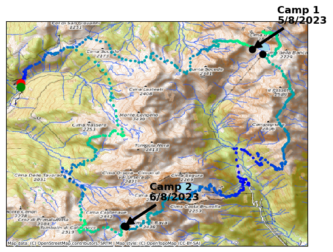

# gpx_map_maker

Turn your hikes into maps. Feed it a GPX file, get a clean visualization of your route with elevation coloring, heart rate, and altitude profiles.

## What it does

`gpx_map_maker` is a command-line tool that parses GPX files recorded during hikes and visualizes the hikes onto a map:

- a **route map** with elevation rendered as a color gradient (blue → green via `winter` colormap), with start (green) and end (red) markers,
- an **elevation profile** plot (time vs. altitude), if elevation data is present in the file,
- a **heart rate** plot (time vs. BPM), if heart rate data is present in the file,

For multi-day hikes (multiple GPX files), it produces a single combined map with overnight stops annotated by date.

An optional OpenTopoMap basemap can be added at a configurable zoom level, using the `contextily` dependency.

## Requirements

Install dependencies, e.g. via conda:

```bash
conda install numpy matplotlib contextily
```

## Simple example
A simple example is provided in this repository

Single-day hike:
```bash
python gpx_map_maker.py -p examples/sigle_day/trek.gpx -bm -op ./examples/single_day
```
| Track | Elevation | Heart Rate |
|---|---|---|
|  |  |  |

Multi-day hike:
```bash
python gpx_map_maker.py -p examples/multi_day/day1.gpx examples/multi_day/day2.gpx examples/multi_day/day3.gpx -bm 13 -op ./examples/multi_day/
```



Run `python gpx_map_maker.py -h` for the full list of options.

## Main features

- Parses GPX track data: coordinates, timestamps, elevation, and heart rate,
- renders route map with elevation colormap and start/end markers,
- overlays OpenTopoMap basemap at configurable zoom (optional),
- adds numbered annotations at specified timestamps (`-t`) or via interactive click (`-mi`),
- supports multi-day hikes from multiple GPX files, with overnight stop labels,
- generates separate elevation and heart rate time-series plots when data is available.
